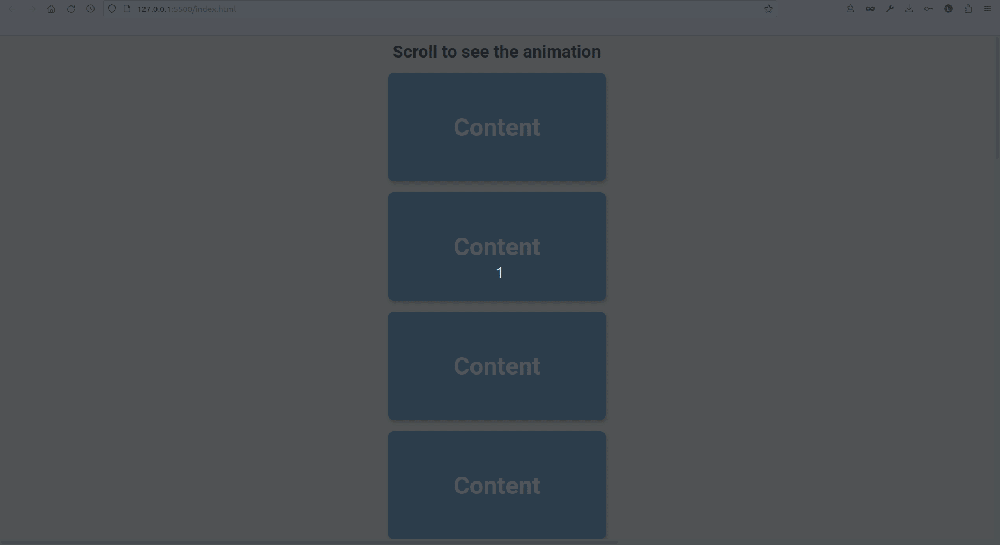

# Scroll Animation

## Information

Scroll animation functionality

The project goal:

- when user scroll in page, show the user nice smooth animation with ease.
- use Flexbox to align everything
- add a JavaScript so that when the user scroll the content came into middle from left and right, it change the class to show and it then translateX() with a CSS transition ease
- using JavaScript for the event listeners and getBoundingClientRect()
- using CSS transitions to give it the smooth through the effect

## Built With

[HTML5](https://www.w3schools.com/html/) / [CSS3](https://www.w3schools.com/css/) / [JavaScript](https://www.w3schools.com/js/)
